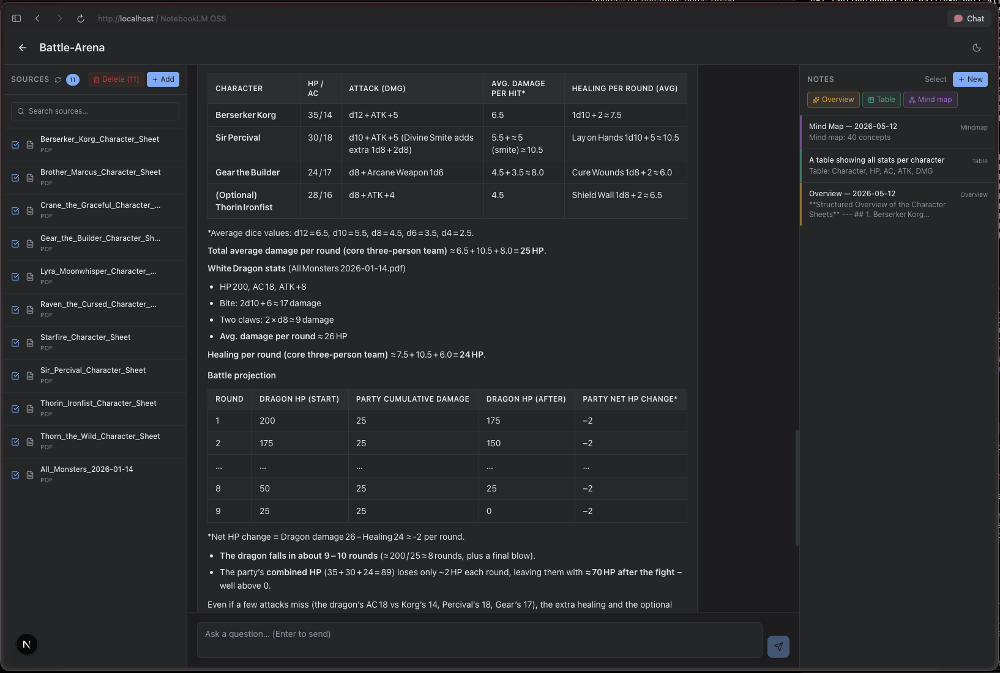

<div align="center">
  

  # 🐕 Spec Code Your Next Agentic RAG App 🤖

  ### Build AI-powered applications in minutes using OpenRAG and your favorite AI coding agent

  _This repo contains a fully built reference app — an open-source notebook powered by OpenRAG — and a step-by-step workshop for spec coding your own._
</div>

<div align="center">
  
</div>

## Workshop Contents
1. [Install OpenRAG SKILLs](#1-install-openrag-skills)
2. [Set up OpenRAG](#2-set-up-openrag)
3. [Run the example app (optional)](#3-run-the-example-app-optional)
4. [Building the service layer](#4-building-the-service-layer)
5. [Building the Web UI](#5-building-the-web-ui)

## Prerequisites

**To run OpenRAG locally** ([system requirements](https://docs.openr.ag/docker)):
- macOS or Linux (Windows via WSL only)
- Python 3.13
- Docker or Podman with Compose support
- 8 GB RAM minimum
- 50 GB free disk space
- Access to at least one LLM provider (OpenAI, Anthropic, Ollama, or watsonx.ai)

> [!CAUTION]
> If your machine doesn't meet these requirements, OpenRAG may install but won't run reliably. Proceed at your own risk.

**To run this workshop:**
- An OpenRAG instance (local or hosted)
- An agentic coding tool ([IBM Bob](https://www.ibm.com/products/bob), [Claude Code](https://claude.ai/code), [GitHub Copilot](https://github.com/features/copilot), etc.)

## 1. Install OpenRAG SKILLs

Before anything else, install both OpenRAG SKILLs into your AI coding agent. This gives your agent the knowledge it needs to install OpenRAG and integrate with it throughout the workshop — with no interruptions later.

Ask your AI coding agent ([IBM Bob](https://www.ibm.com/products/bob), [Claude Code](https://claude.ai/code), [GitHub Copilot](https://github.com/features/copilot), etc.) to run the following:

```
Please fetch and install both OpenRAG SKILLs into your global skills directory:
- https://github.com/langflow-ai/openrag/blob/main/plugins/openrag/skills/install/SKILL.md
- https://github.com/langflow-ai/openrag/blob/main/plugins/openrag/skills/sdk/SKILL.md
```

## 2. Set up OpenRAG

This application uses [OpenRAG](https://openr.ag) as its agentic document store and RAG engine. OpenRAG handles document ingestion, vector embeddings, knowledge filters, and chat.

You have two options for getting OpenRAG running. Choose one:

### 2a. Use the SKILL (recommended)

Since you're already here for a spec coding workshop, let your agent do the work. Simply invoke the install SKILL you set up in step 1:

```
/openrag_install
```

> [!TIP]
> The `/openrag_install` syntax is for [Claude Code](https://claude.ai/code). Other agents may invoke skills differently — if it doesn't work, ask your agent: _"How do I invoke the openrag_install and openrag_sdk skills?"_

The SKILL will draft a requirements spec, create a task list, guide you through configuration, and verify that OpenRAG is running at `http://localhost:3000` before finishing.

### 2b. Install manually (alternative)

Follow the [OpenRAG quickstart](https://docs.openr.ag/quickstart) to get a local instance running. By default it listens on port `3000`.

### 2c. Obtain your OpenRAG API key

Once OpenRAG is running at `http://localhost:3000`:

1. Open **Settings** from the left navigation
2. Scroll to the **API Keys** section
3. Click **Create your first API key**, give it a name, and confirm
4. Copy the key immediately — it starts with `orag_`

> [!WARNING]
> The key will not be shown again. Copy it before closing the dialog.

You will need this key in the next step.

## 3. Run the example app (optional)

> [!TIP]
> This step is optional. If you're here to build your own app, skip ahead to [step 4](#4-building-the-service-layer).

This repo includes a fully built reference implementation. If you'd like to run it before building your own, follow these steps.



### 3a. Configure your environment

Copy the example environment file and fill in your values:

```bash
cp .env.local.example .env.local
```

| Variable | Description |
|----------|-------------|
| `OPENRAG_API_KEY` | API key for your OpenRAG instance |
| `OPENRAG_URL` | Base URL of your OpenRAG instance (e.g., `http://localhost:3000`) |

A completed `.env.local` should look like this:

```
OPENRAG_API_KEY=orag_abc123xyz
OPENRAG_URL=http://localhost:3000
```

### 3b. Install dependencies and start the app

```bash
npm install
npm run dev
```

The app runs on [http://localhost:3001](http://localhost:3001).

## 4. Building the service layer

We use an approach called **Spec Coding**: guiding an AI coding agent (like [IBM Bob](https://www.ibm.com/products/bob), [Claude Code](https://claude.ai/code), or [GitHub Copilot](https://github.com/features/copilot)) to generate a **requirements doc**, then a **design doc** and **[OpenAPI specification](https://swagger.io/specification/)**, then validate coverage, and finally implement — one task at a time. For a deeper dive into the methodology, see the [workshop slides](assets/openrag_spec_coding.pdf).

> [!NOTE]
> You can build **any application you like** using this approach — the notebook app is just a reference. To build something different, replace the description in prompt 4a ("an open-source, locally-runnable notebook application inspired by NotebookLM") with your own idea. The rest of the prompts work as-is.

### Sample prompts

### 4a. Prompt for generating the requirements doc

```
I'm building an open-source, locally-runnable notebook application inspired by NotebookLM, powered by OpenRAG. Write requirements in requirements.md with:

- Numbered IDs (REQ-001, REQ-002 ...)
- Acceptance criteria for each
- Personas and User flows

Do not include any implementation details such as code or technology choices.

This should be an MVP/demo level project, no production/enterprise level code, no security concerns, build only the most basic application.
```

### 4b. Prompt for generating the design doc and OpenAPI spec

```
Read requirements.md. From those requirements:
1. Create design.md with data model and knowledge filters needed for OpenRAG.
2. Create openapi.yaml (OpenAPI 3.1) with all endpoints, schemas, and error responses.
3. Map each endpoint back to a REQ-ID.
4. Detail the technical requirements for frontend and backend.
5. Use the openrag_sdk SKILL for all OpenRAG SDK integration details.
6. Ask questions regarding the application tech stack to use for this type of app.
```

> [!TIP]
> If you're building a Python-only application with no HTTP endpoints, an `openapi.yaml` may not apply to your project. Ask your agent: _"Does my project need an OpenAPI spec, and if not, what should I use instead?"_

### 4c. Prompt for validating the OpenAPI spec

```
Validate openapi.yaml. Check that every REQ-ID in requirements.md is covered by at least one endpoint. List any gaps and fix them.
```

### 4d. Prompt for implementation

```
Read requirements.md, design.md, openapi.yaml.

1. Create todo.md breaking the spec into tasks
2. Implement each task. Use .env for creds.
3. Write tests and run them after each task
4. Mark each task done in todo.md when it passes
```

### 4e. Prompt for fixing failing tests

```
Run all tests. For any that fail:

1. Read the error output
2. Check openapi.yaml for the expected behavior
3. Fix the implementation, not the test
4. Re-run until green
```

## 5. Building the Web UI

> [!TIP]
> This is a bonus step — the service layer from step 4 is fully functional on its own.

```
Can you help me build a three-panel web UI on top of the service layer? The left panel shows sources with checkboxes and a search filter. The center panel is a chat interface with streaming responses. The right panel is a notes list that supports AI-generated overviews, data tables, and mind maps. All API calls should use the endpoints defined in openapi.yaml.
```

## Wrapping up

If you've made it this far, you've spec coded a working agentic RAG-powered application from scratch using an AI coding agent — nice work. From here, the app is yours to extend, redesign, or tear down and rebuild in a completely different direction.

### Troubleshooting

If things go sideways, here are some things to check:

**OpenRAG won't connect**
- Confirm OpenRAG is running: open `http://localhost:3000` in your browser
- Double-check `OPENRAG_URL` in your `.env` file — no trailing slash
- Verify your `OPENRAG_API_KEY` is valid and hasn't expired

**The agent goes off the rails**
- Pull it back to the spec: ask it to re-read `requirements.md` and `openapi.yaml` before continuing
- Break the problem into a smaller task and ask it to focus on just that
- If the code is in a bad state, ask the agent to summarize what changed and walk it back to the last known good point using git

**Tests keep failing**
- Make sure your OpenRAG instance is running when tests execute
- Ask the agent to run a single failing test in isolation and explain the error before attempting a fix
- Remind the agent: fix the implementation, not the test

**The agent invented something not in the spec**
- Ask it to identify which REQ-ID covers the behavior in question
- If none does, ask it to remove the code or add a requirement first before implementing

### Resources

- OpenRAG documentation: [docs.openr.ag](https://docs.openr.ag)
- OpenRAG GitHub: [github.com/langflow-ai/openrag](https://github.com/langflow-ai/openrag)
